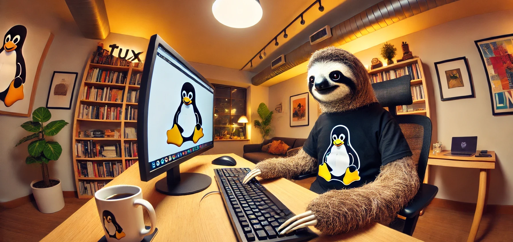

# Linux Desktop LLM Apps

 This repository is a small gathering of different large language model frontends that are accessible for Linux desktop users. 

 Given that self hosted tools which can run on Linux servers are a much larger list, but which also often serve a different purpose, this list is primarily focused on desktop clients. 

 Exciting new LLM apps are being developed at a papid pace. If you're developing one and would like to add it to the list, please just drop me an email or open a pull request  

## Local LLM Frontends

*GUIs and CLIs for running large language models (LLMs) on Linux.*

---

### GUIs

#### [Anything LLM](https://docs.anythingllm.com/installation-desktop/linux#install-using-the-installer-script)
*Desktop application for working with LLMs.*  

An interesting front end which covers a lot of different bases, including interaction with multiple cloud model providers, built-in RAG, and some voice features.

  

#### [LM Studio](https://lmstudio.ai)
*Discover, download, and run local LLMs.*  

I highly recommend LM Studio as an excellent starting point for anyone looking at hosting models locally on Linux for the first time. A well rounded and versatile tool. 

  

#### [gpt4all](https://github.com/nomic-ai/gpt4all)
*Run Local LLMs on Any Device. Open-source and available for commercial use.*

#### [Jan](https://jan.ai/)

 
    

#### [Chatbox AI](https://chatboxai.app/en)
*AI client application and smart assistant, compatible with many cutting-edge AI models and APIs. Available on multiple platforms, including Linux.*

   

#### [Msty](https://msty.app/)
*Supports remote and local models with a variety of download options for Linux, including separate AppImages for AMD and NVIDIA GPUs.*
*Confirmed running perfectly on OpenSUSE Tumbleweed on 01/01/25.*

   

---

### CLI & Core

#### [Ollama](https://ollama.com/)
*"Run Llama 3.2, Phi 3, Mistral, Gemma 2, and other models. Customize and create your own."* 

#### [Alpaca](https://github.com/Jeffser/Alpaca)

#### [Chatbox](https://github.com/Bin-Huang/chatbox)

#### [shellgpt](https://github.com/jiacai2050/shellgpt)

---

### Voice-Centric Apps

Large language model front ends which emphasize voice features such as seamless speech-to-text, text-to-speech or speech-to-speech/realtime conversation.

#### [PyGPT](https://pygpt.net/)

Very interesting project which has put emphasis on multimodal interaction, an area where many local front ends have struggled to keep up. 

   
 
---
## Stuff To Add

*   CLIs, TUIs, wrappers

---

## Author

Daniel Rosehill  
(public at danielrosehill dot com)

## Licensing

This repository is licensed under CC-BY-4.0 (Attribution 4.0 International) 
[License](https://creativecommons.org/licenses/by/4.0/)

### Summary of the License
The Creative Commons Attribution 4.0 International (CC BY 4.0) license allows others to:
- **Share**: Copy and redistribute the material in any medium or format.
- **Adapt**: Remix, transform, and build upon the material for any purpose, even commercially.

The licensor cannot revoke these freedoms as long as you follow the license terms.

#### License Terms
- **Attribution**: You must give appropriate credit, provide a link to the license, and indicate if changes were made. You may do so in any reasonable manner, but not in any way that suggests the licensor endorses you or your use.
- **No additional restrictions**: You may not apply legal terms or technological measures that legally restrict others from doing anything the license permits.

For the full legal code, please visit the [Creative Commons website](https://creativecommons.org/licenses/by/4.0/legalcode).